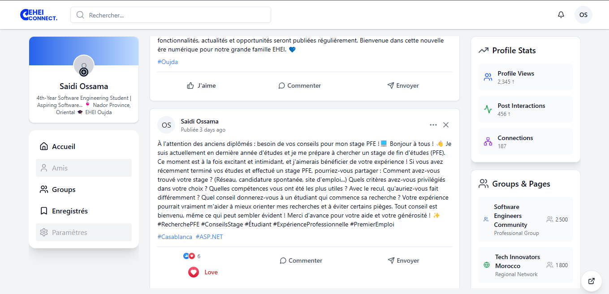
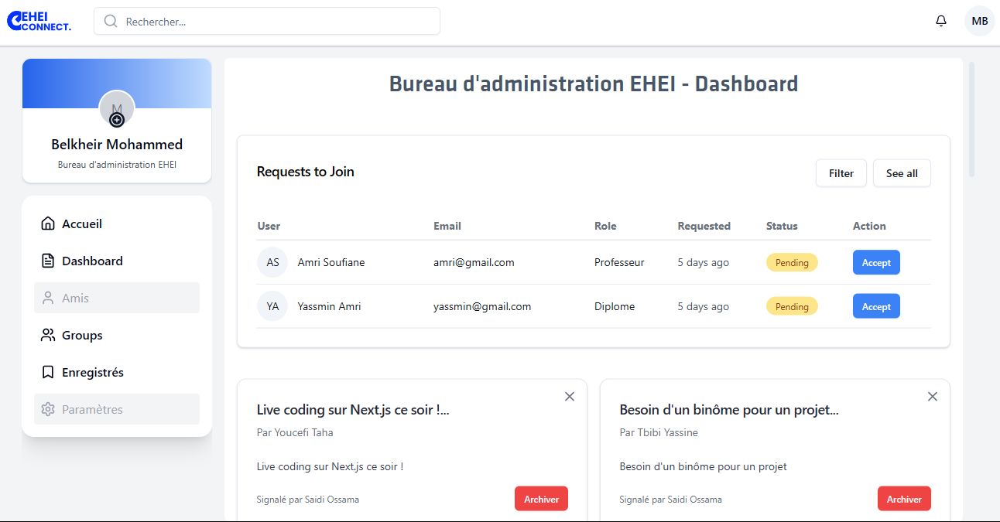

# EHEI Connect – Réseau Social Éducatif 🧑‍🎓👨‍🏫

**Projet de fin d’année – École des Hautes Études d’Ingénierie, Oujda**  
🎓 Génie Informatique – Promotion 2024/2025

## Objectif du Projet

**EHEI Connect** est une plateforme sociale conçue pour connecter les **étudiants**, **enseignants** et **anciens lauréats** de l’EHEI.  
Elle facilite :
- Le **partage d'opportunités** (stages, offres d’emploi),
- La **messagerie instantanée** entre membres,
- La **création de groupes** collaboratifs,
- Une **recherche intelligente** d’utilisateurs ou publications.

## Pourquoi ce projet ?

Nous avons identifié un manque de communication numérique entre les différentes générations de l’école.  
Ce projet vise à créer un **espace d’échange sain et utile**, accessible à tous les membres de la communauté.

## 🛠Stack Technique

| Domaine | Technologies |
|--------|--------------|
| **Frontend** | React.js (Next.js) + TailwindCSS |
| **Backend** | NestJS + Prisma ORM |
| **Communication interservices** | RabbitMQ (Event-driven architecture) |
| **Authentification** | JWT + Guards NestJS |
| **Base de données** | MySQL |
| **Cache** | In-Memory (per-service) + stratégie de synchronisation via RabbitMQ |
| **Monitoring** | Grafana + Prometheus |
| **Architecture** | Full Microservices (6 domaines : User, Group, Messaging, Publication, Search, Notifications) |
| **Déploiement** | Docker + Docker Compose |

## Fonctionnalités principales

- ✅ Authentification sécurisée (JWT)
- ✅ Publication & réactions
- ✅ Messagerie temps réel (Socket.IO)
- ✅ Groupes collaboratifs
- ✅ Recherche avancée
- ✅ Notifications SSE
- ✅ Tableau de bord admin (gestion de contenu & utilisateurs)
- ✅ Caching dynamique (mise à jour via events)

## Répartition des tâches

- **Ossama Saidi** : Service Publications, Utilisateurs, coordination technique, RabbitMQ, Cache
- **Imane Bouchlaghem** : Messagerie
- **Otmane Guilli** : Notifications
- **Abdelilah Melhaoui** : Groupes, Utilisateurs
- **Kaouthar Benmhammed** : Recherche

## Architecture

L'architecture est orientée **microservices** pour permettre la **scalabilité**, **modularité**, et **indépendance des services**.  
La communication interservices repose sur **RabbitMQ** (via événements AMQP), chaque service pouvant émettre ou consommer des events selon les cas.

📌 Voir le schéma d’architecture dans `/docs/architecture.png`.

## 📸 Aperçu du projet

| Fonctionnalité | Capture |
|----------------|---------|
| Connexion |  |
| Fil d’actualité |  |
| Groupe collaboratif |  |
| Tableau admin |  |

## Rapport & Soutenance

Le rapport complet du projet est disponible dans ce repo :  
📎 `Plateforme de Réseau Social.pdf`  
📅 Soutenance : 2 mai 2025

## 📬 Contact

👤 Ossama SAIDI  
📧 osm.saidi@gmail.com  
🔗 [LinkedIn](https://linkedin.com/in/ossamasaidi)

---

> Ce projet illustre notre capacité à **concevoir**, **développer** et **déployer** une solution complète, modulaire et sécurisée en équipe.  
> Nous sommes ouverts à toutes opportunités de stage ou collaboration technique dans le domaine du **développement web, backend Node.js/NestJS** ou **architecture logicielle**.

